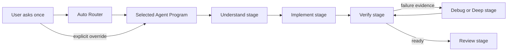

# Adaptive Agent Programs

> Status: product proposal; not scheduled for implementation.
>
> This document describes a possible direction after the currently approved
> Phase 0–10 plan. It is not a statement of current CLI behavior, it does not
> change the active roadmap, and none of the example interfaces or commands
> below exist yet.

## Product promise

**内部一切皆插件，外部完全感觉不到插件。**

The product goal is not to make users manage an extension framework. The goal
is to make `dsh` feel immediately useful: zero-configuration for ordinary work,
adaptive when a task becomes difficult, economical about context, and always
easy for the user to take over.

Security, durable logs, and replay remain mandatory engineering foundations.
They are not the primary product pitch. Users should mainly notice that the
right workflow appears at the right time, that switching workflows does not
lose their conversation or workspace, and that an unsuccessful approach can
improve itself without asking them to start over.

## Why introduce Programs and Stages

A single fixed Agent loop is easy to reason about, but it forces every task
through the same balance of speed, planning, exploration, verification, and
cost. Letting every extension author replace the whole loop creates the
opposite problem: duplicated plumbing, incompatible behavior, and poor
composition.

This proposal introduces two product-level units:

- An **Agent Program** is a complete, runnable strategy for a class of tasks. It
  chooses a sequence of stages, transition rules, budgets, prompts, tools, and
  verification requirements.
- A **Program Stage** is a reusable part of a strategy, such as understand,
  plan, implement, reproduce, debug, test, review, or release. A stage has a
  typed input/output contract so Programs can compose it without copying an
  entire loop.

The high-level Program/Stage API should be the normal extension surface. A
lower-level Loop API may exist for advanced integrations, but it must not be the
only way to contribute useful behavior.



The diagram is conceptual. It does not define a current command or wire
protocol.

## A small official Program set

The long-term product may ship carefully tuned official Programs such as:

| Program | Intended behavior |
| --- | --- |
| General | Balanced default for ordinary repository work. |
| Fast | Small changes with minimal ceremony and quick verification. |
| Debug | Reproduce, isolate, instrument, fix, and rerun the failing case. |
| Deep | Broad investigation, difficult architecture, and larger reasoning budget. |
| Review | Read-only or minimally mutating audit with evidence-ranked findings. |
| Release | Release checks, packaging, changelog, and rollback-aware publication. |

These names describe a target catalogue, not an initial bundle requirement.
The first implementation should ship only a few Programs whose behavior is
meaningfully different and well tested. It must not preinstall a dozen shallow
personas distinguished only by prompt wording.

Official and third-party Programs use the same documented contracts. Official
code may be better tested, signed, bundled, or selected by default, but it must
not receive a hidden business-logic bypass around permissions, event logging,
resource limits, or lifecycle rules.

## Auto Router and smooth transitions

The default experience is an **Auto Router**. It selects a Program using bounded
facts such as:

- task intent and explicit user constraints;
- repository languages and project structure;
- estimated modification scope;
- recent failures and retries;
- tool results and verification evidence;
- remaining time, token, and context budgets;
- direct user correction or preference.

Routing is not a one-time classifier. A running Program can upgrade or
downgrade when evidence changes. For example:

```text
Fast → Debug → Deep → Review
```

A small edit may begin in Fast. Repeated test failures can move it into Debug;
an architectural conflict can promote it to Deep; a successful fix can finish
through Review. A simpler path may move back down to Fast.

The transition must preserve the same session, workspace authority, user goal,
and relevant evidence. The user must not have to repeat the request. The UI
should show the active Mode/Agent and why it changed, with one simple way to
override Auto. An explicit override is authoritative until the user releases it
or accepts a suggested change.

Users should not need to understand Programs, Stages, manifests, or dependency
graphs. The public mental model is deliberately small: **Auto**, a named
**Mode/Agent**, and an optional explicit choice.

## Extension contribution points

The eventual extension model should cover at least:

- a complete Agent Program;
- a reusable Program Stage;
- a Tool;
- a Skill or other Context Source;
- a Command;
- a Provider;
- a Renderer or visual Preset.

These capabilities need different trust and lifecycle policies; “everything is
a plugin internally” does not mean every plugin receives every authority. Each
capability must declare what it needs, and the host keeps ownership of
permissions, durable facts, cancellation, budgets, and cleanup.

The high-level API should make the safe path easiest. A Stage author should be
able to declare inputs, outputs, activation hints, and required capabilities
without rebuilding Session persistence, approval handling, signal cleanup, or
the complete Agent loop.

## Discovery without context pollution

Extension metadata is discovered before implementation code or prompt content
is loaded. The metadata should be small enough to index and route on, and should
describe at least identity, version, contribution type, activation hints,
capabilities, compatibility, and resource expectations.

The selected implementation is loaded only when a task needs it. An unselected
Program's prompts, Skills, examples, and tool schemas must not enter the model
context. Discovery is therefore not equivalent to activation.

This rule is a product requirement, not merely an optimization: installing more
capabilities must not silently make every ordinary request slower, more
expensive, or less focused.

## Installation and first-use experience

The target experience is:

1. install a capability with one command;
2. configure it in place the first time it is selected;
3. roll back cleanly if installation or configuration fails;
4. make it available without restarting `dsh`;
5. if a task lacks a capability, suggest a suitable installation and continue
   the original task after the user approves it.

This is a conceptual product flow, not a currently implemented command surface.
Installation must be transactional: a failed install cannot leave a
half-discoverable capability. Continuing the original task must reuse the same
goal/session rather than opening a disconnected conversation.

## Accurate comparison with DeepSeek Harness

It would be inaccurate to claim that the pinned DeepSeek Harness has no
adaptive or extensible behavior. It already has Presets, Plan Mode, Skills
loaded from descriptions, Goal-driven continuation, Cordis interception points,
and dynamic packages. Cordis could theoretically host much of this proposal.

What is missing as a unified default product abstraction is the complete path:

```text
task recognition → Program selection → on-demand activation
                 → stage transitions and escalation
```

Therefore `dsh` cannot differentiate itself merely by adding a classifier. Its
advantage would need to come from the default experience, a stable Program and
Stage standard, smooth in-session transitions, the quality of official tuning,
and an ecosystem that follows the same contracts.

Compatibility with the pinned upstream default loop remains a hard test
boundary. Adaptive Programs must be layered so the fixed upstream-compatible
default behavior can still be selected and tested deterministically; they may
not rewrite existing compatibility tests to make a new architecture appear
compatible.

## Safety and replay as substrate

Programs and Stages do not own raw side effects. Existing host rules remain in
force:

- tool intent is durably recorded before a side effect;
- permission and approval cannot be bypassed;
- cancellation and shutdown have one explicit owner;
- resource limits are checked before irreversible work;
- Program selection and stage transitions become replayable facts;
- recovery does not rerun an uncertain external action.

These properties make adaptive behavior trustworthy, but the user-facing
message remains usefulness: the system chooses and changes strategy well while
the user retains control.

## Non-goals and constraints

This proposal explicitly does not:

- add implementation work to Phase 8 or Phase 9;
- change the currently approved Phase 10 bounded subprocess **tool** plugin;
- modify the Phase 0–10 completion gates in `AGENTS.md` or the current status in
  `docs/roadmap.md`;
- ship a large collection of lightly differentiated Agents;
- break the fixed-upstream default Loop or weaken its compatibility tests;
- require every extension author to replace the complete Agent loop;
- load every installed prompt, Skill, or tool schema into every request;
- promise dynamic untrusted native libraries, arbitrary in-process hooks, or a
  security sandbox merely because a capability is called a plugin;
- present any example Mode, router, installer, or command in this document as a
  feature that already exists.

The first real delivery should focus on a small number of high-quality Programs
and a narrow, auditable Stage contract. Breadth comes only after the contracts
and user experience are proven.

## Proposed future acceptance measures

A formal implementation plan should not be accepted without tests or product
evidence for at least these outcomes:

1. A new user completes an ordinary coding task with zero Program
   configuration.
2. Automatic routing is visible, understandable, and replaceable with one user
   action.
3. At least three Programs exhibit genuinely different stage sequences,
   budgets, or verification behavior—not merely different names or system
   prompts.
4. A failed fast attempt can automatically escalate and continue in the same
   session and workspace without asking the user to restate the task.
5. A third party can contribute one reusable Stage from a documented template
   and compose it into a Program without implementing a whole loop.
6. Prompts, Skills, examples, and tool schemas belonging only to inactive
   capabilities are absent from the model request.
7. Official and third-party Programs pass the same permission, logging,
   cancellation, recovery, and resource-limit contracts.
8. Installation failure rolls back, successful first-use configuration needs no
   restart, and an approved capability suggestion resumes the original task.

## When this becomes a formal phase proposal

This document is a holding place for an approved product direction, not a
roadmap change. The earliest normal review point is after the currently approved
Phase 8–10 work is complete. At that point a separate proposal must show:

- the original Phase 10 scope;
- any suggested successor or expansion;
- compatibility, migration, security, and maintenance risks;
- a staged implementation and validation plan.

Changing or replacing Phase 10 itself requires explicit user approval. The
proposal may enter review earlier only if the user separately asks to change the
current roadmap; it must never arrive indirectly through Phase 8 or Phase 9
implementation work.
