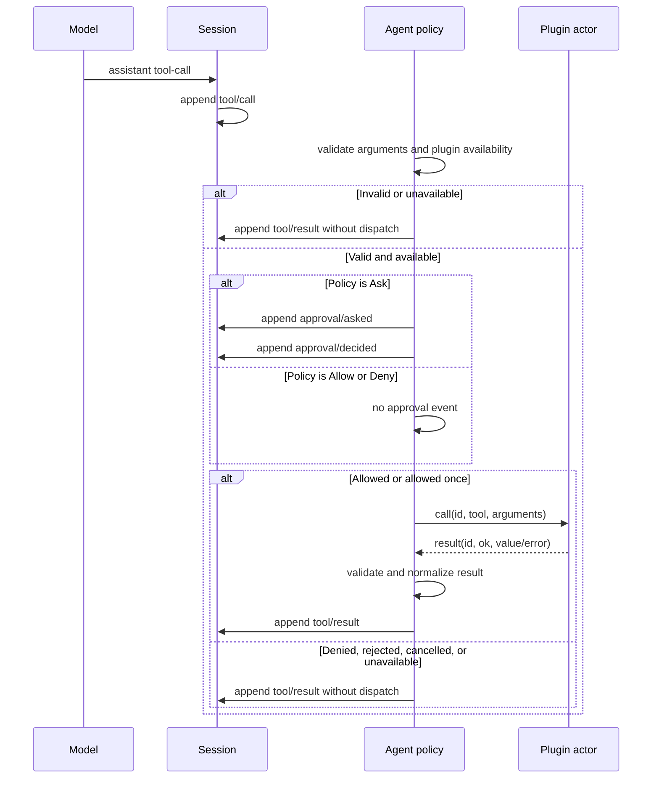

# Phase 10 bounded subprocess tool-plugin design

This document fixes the Phase 10 contract and records the production
implementation boundary.
The feature is a deliberately small way to add local tools to `dsh`: the user
explicitly names a configuration file, each configured plugin is one owned
child process, and the host exchanges bounded one-line JSON messages over that
process's standard input and output.

The goal is useful extensibility without turning the Agent into a general RPC
host. A plugin can declare tools and answer calls. It cannot replace the model
provider, write Session events, install hooks, add Agent lifecycle callbacks,
load native code into the `dsh` process, or bypass the existing tool approval
pipeline.

## Scope and non-goals

Phase 10 adds:

- one explicit `--plugin-config <PATH>` startup option for interactive and
  script runs, including `--resume`;
- a versioned JSON configuration with a small, closed set of fields;
- at most eight configured local plugin processes and 32 plugin tools in total;
- a versioned NDJSON protocol with only `hello`, `call`, `cancel`, and `result`
  message semantics;
- strict parameter and output-schema validation in the host;
- an independent plugin approval policy whose interactive default is `Ask` and
  whose non-interactive default is `Deny`;
- one active call per plugin, bounded queues, bounded protocol output, bounded
  stderr diagnostics, call deadlines, cooperative cancellation, and owned
  process-group cleanup;
- two harmless examples (`text-stats` and `json-format`) plus a fault fixture;
- installed-CLI tests covering startup, calls, approval, restart, cancellation,
  timeout, crash, protocol faults, backpressure, and cleanup on macOS and Ubuntu.

Phase 10 does **not** add:

- Cordis/npm plugin compatibility, profile bundles, package installation, hot
  reload, plugin discovery, or a project-local auto-load directory;
- MCP, arbitrary RPC methods, event subscriptions, hooks, background jobs,
  Provider replacement, Session mutation, UI injection, or nested Agent calls;
- dynamic Rust libraries, shared memory, sockets, a daemon, or a plugin process
  shared between separate `dsh` instances;
- Windows support, a native-code sandbox, filesystem or network confinement, or
  protection from a malicious executable the user explicitly configured;
- automatic retry after a crash or an uncertain dispatched call.

Configured plugins are trusted local programs. `dsh` reduces accidental secret
exposure and owns their process lifecycle, but starting one can itself execute
arbitrary code as the current user. Per-call approval prevents the model from
silently dispatching a declared plugin tool; it does not make the already
configured plugin process harmless.

## Upstream reference and intentional difference

The semantic baseline remains DeepSeek Harness commit
`47f943859bef60e4160492346772ded9b24f765a`. The inspected paths are recorded in
`docs/upstream.md`.

Fixed upstream registers `ToolDefinition` values inside the same process through
the Cordis `ToolRuntime`. Its CLI profile system installs npm packages and loads
bundle patches. Tool execution still has the important observable order that
Rust preserves: the assistant declares a call, the Session records `tool/call`,
optional policy/approval runs, the body runs, the canonical result is normalized,
and one correlated `tool/result` is recorded.

The subprocess transport is therefore an intentional difference, not a
claim of Cordis compatibility:

1. Rust uses an explicit local JSON file rather than an npm profile and bundle
   layer stack.
2. Rust starts an external executable instead of importing trusted JavaScript
   into the host process.
3. Rust supports a closed schema/protocol subset rather than Cordis services,
   waterfalls, scoped contexts, post-processing hooks, UI presenters, or code
   mode.
4. Rust can terminate an uncooperative plugin process group, whereas upstream
   same-process tool code must cooperate with an `AbortSignal`.
5. Rust asks before every model-requested plugin call by default. Configuring the
   executable authorizes startup and schema discovery, not automatic calls.
6. Upstream `defineTool()` validates arguments inside its execution wrapper,
   after pre-execute/ask policy. Rust validates a subprocess plugin's declared
   schema before asking, so malformed arguments create no approval prompt and no
   protocol call.

These differences are the feature's safety and auditability boundary. They also
mean an upstream Cordis plugin cannot be used by pointing this feature at its
package, and a Rust NDJSON plugin cannot be installed with upstream `dsh plugin`.

## User configuration

The only discovery seam is an explicit command-line option:

```console
dsh --plugin-config /absolute/path/to/plugins.json
dsh --resume SESSION_ID --plugin-config /absolute/path/to/plugins.json
```

No config means no plugin process, schema, or plugin-related discovery.
`--list-sessions` does not start plugins. Phase 10 builds are supported only on
the declared macOS and Ubuntu/Linux targets, and the option is not persisted
into the Session. A resumed CLI must name the
configuration again; the reconstructed request header can then record the
resulting tool-schema change without storing an executable path in JSONL.

Configuration version 1 is a closed JSON object:

```json
{
  "version": 1,
  "plugins": [
    {
      "id": "text-tools",
      "program": "/absolute/path/to/text-tools-plugin",
      "args": []
    }
  ]
}
```

Rules:

- the encoded file is at most 64 KiB and contains valid UTF-8 JSON with no
  unknown fields or duplicate keys at any nesting level;
- the path supplied to `--plugin-config` is resolved once from the startup
  directory, then opened with `O_NOFOLLOW | O_CLOEXEC | O_NONBLOCK`; admission
  and reads use `fstat` on that same descriptor;
- the config descriptor names a regular file owned by the effective user, with
  no group/other permission bits; on macOS any extended ACL `ALLOW` entry is
  rejected (deny-only ACLs remain acceptable);
- `version` is exactly `1`; `plugins` contains at most eight entries;
- plugin IDs match `[a-z][a-z0-9-]{0,31}` and are unique;
- `program` is an absolute, canonical, regular executable owned by the effective
  user or root, is not group/other writable, and has neither setuid nor setgid
  bits; a final symlink is rejected and identity is rechecked before spawn;
- `args` contains at most 16 strings and at most 32 KiB encoded UTF-8 in total;
- no config entry has a dedicated working-directory, environment, secret,
  approval-bypass, timeout, or Session-capability field. `args` is ordinary
  process argv and must not contain secrets because same-account process
  inspection may expose it.

The child starts in the executable's parent directory. The host clears the
ambient environment and sets only `PATH=/usr/bin:/bin`, `LANG=C`, `LC_ALL=C`,
`DSH_PLUGIN_PROTOCOL=1`, and `DSH_PLUGIN_ID=<id>`. In
particular it does not forward `DEEPSEEK_API_KEY`, proxy variables, `HOME`, the
workspace path, Session IDs, agent sockets, loader variables, or arbitrary
`DSH_*` values. Model-requested plugin tool arguments and results remain part of
the normal model/Session boundary.

Validation happens before the first Provider request. If any entry, executable,
spawn, or handshake fails, the whole plugin assembly fails; already started
plugins are shut down before the CLI returns. `dsh` never silently exposes only
a subset of a requested configuration.

## Protocol version 1

Every protocol record is exactly one UTF-8 JSON object followed by LF. The
maximum encoded record, including LF, is 128 KiB. Blank lines, a BOM, invalid
UTF-8, trailing bytes, unknown fields, duplicate JSON keys, and unsupported
message types are protocol faults. The strict decoder additionally caps one
record at 64 container levels and 65,536 parsed JSON nodes; the narrower schema
and runtime-value limits below are then applied to retained fields. Standard
output carries protocol only; standard error carries bounded diagnostics only.

The host speaks first:

```json
{"version":1,"type":"hello","plugin_id":"text-tools"}
```

The plugin answers once:

```json
{
  "version": 1,
  "type": "hello",
  "plugin_id": "text-tools",
  "tools": [
    {
      "name": "text_stats",
      "description": "Count characters, words, and lines in text.",
      "parameters": {
        "type": "object",
        "properties": {"text": {"type": "string"}},
        "required": ["text"],
        "additionalProperties": false
      },
      "output": {
        "type": "object",
        "properties": {
          "characters": {"type": "integer"},
          "words": {"type": "integer"},
          "lines": {"type": "integer"}
        },
        "required": ["characters", "words", "lines"],
        "additionalProperties": false
      }
    }
  ]
}
```

After one committed and approved call, the host sends:

```json
{"version":1,"type":"call","id":1,"tool":"text_stats","arguments":{"text":"hello"}}
```

The plugin sends exactly one matching result:

```json
{"version":1,"type":"result","id":1,"ok":true,"value":{"characters":5,"words":1,"lines":1}}
```

or:

```json
{"version":1,"type":"result","id":1,"ok":false,"error":{"code":"INVALID_TEXT","message":"text could not be processed"}}
```

When the caller, tool deadline, or turn deadline cancels an active call, the
host sends at most one:

```json
{"version":1,"type":"cancel","id":1}
```

There is no separate cancel acknowledgement. A matching `result` proves the
trusted plugin considers the call settled, but it cannot replace the already
latched caller-cancelled, tool-timeout, or turn-timeout outcome with success.
Sending `cancel` and waiting for that result share one 500 ms grace; the generic
one-second call-write limit cannot extend it. If the plugin does not settle in
that grace, the host terminates the plugin group and marks that plugin
unavailable for the rest of the process.

The actor records an explicit linearization state:

- `NotDispatched`: no byte of a `call` record has been written;
- `WriteStarted`: a bounded write is in progress, owned by the actor rather than
  abandoned when the caller cancels;
- `MayHaveBeenDispatched`: at least one byte was written, or write completion is
  otherwise uncertain;
- `Dispatched`: the complete record including its final LF was written;
- `Settled`: one complete, matching, protocol-valid `result` was received;
  declared output-schema validation is the next host step.

The completed LF is the normal dispatch point. Queue rejection and a proven
zero-byte write failure cannot run a conforming plugin call. Once any call byte
was written, however, a broken peer may have acted on a malformed prefix, so the
host uses the conservative `MayHaveBeenDispatched` state. It poisons and cleans
up that process rather than reusing the partial line. `Dispatched` or
`MayHaveBeenDispatched` followed by crash, wrong ID, malformed protocol,
stdout/stderr limit, deadline, or cleanup without a trustworthy matching result
produces `TOOL_OUTCOME_UNKNOWN`, never automatic retry. A matching result
received after cancellation only proves settlement: the earlier
cancellation/timeout remains the user-visible outcome. When no cancellation or
timeout is already latched, a matching invalid output is a definite
`PLUGIN_OUTPUT_INVALID`, because the peer did settle even though its value broke
the declaration.

Protocol identities are unsigned JavaScript-safe integers, start at one, and
are never reused during a plugin process. A plugin may have only one active call.
A result with a stale, future, duplicate, or wrong ID; a second `hello`; a
plugin-originated `call` or `cancel`; an extra record while idle; EOF with a
partial line; or bytes after a terminal protocol fault poison the plugin.

## Tool schema and value boundary

Each plugin declares at most eight tools; all configured plugins together
declare at most 32. Tool names match `[a-z][a-z0-9_]{0,63}`, are unique across
plugins, and must not collide with a built-in tool. Descriptions are non-empty,
control-free UTF-8 of at most 1,024 bytes.

Version 1 supports a closed JSON Schema subset sufficient for the shipped
examples:

- `type`: `string`, `number`, `integer`, `boolean`, `null`, `array`, or `object`;
- scalar `enum` values whose JSON type matches the node;
- one required `items` schema for arrays;
- required `properties` and `required` collections plus explicit
  `additionalProperties: false` for objects;
- optional control-free `description` annotations of at most 1,024 UTF-8 bytes.

Parameter roots must be closed objects. Output roots may use any supported
type. The output declaration is host-only and is not added to the model-facing
`ToolSchema`. Unsupported keywords and ambiguous unions are rejected rather
than ignored. A schema is limited to 16 container levels, 512 nodes, 256
properties, 64 required names, 64 scalar enum entries, and 32 KiB of compact
JSON. Properties, required names, and enum entries are counted across the whole
schema rather than independently per nested object. The validator also bounds
each runtime value to 64 KiB compact JSON and 16 container levels.

Arguments are validated in the host before approval. A mismatch produces the
ordinary correlated invalid-arguments result and sends no `call` record. A
successful plugin `value` is validated against the declared output before it is
rendered. A string value becomes one text block; every other value uses stable
compact JSON. The rendered content must itself fit 64 KiB after JSON escaping.
A plugin error code matches `[A-Z][A-Z0-9_]{0,63}`; its message is at most 4 KiB
and terminal controls are converted to visible text. It maps to
`ToolFailure { name: "PluginError", code }` plus one error text block, not to a
Provider `LlmFailure`. The complete preferred plugin Action event is pre-reserved
and checked against the existing 128 KiB sealed-Action ceiling. The plugin cannot
inject a raw Session event; the TUI visibly escapes terminal controls in every
model/tool string.

## Agent and approval order

Plugin calls use the same authoritative Agent sequence as built-in tools:



`PluginPolicy` is independent from `FileChangePolicy` and `ShellPolicy`:

- interactive CLI: `Ask`;
- `--prompt` and piped input: `Deny`;
- embedders may explicitly choose `Allow`, `Deny`, or `Ask`;
- no approval provider turns `Ask` into denial.

The approval preview names the plugin ID and tool, states that the configured
native process is not sandboxed, and shows bounded sanitized arguments. The
model cannot select the policy. Invalid arguments or a definitely unavailable
pre-dispatch plugin may return a contract-checked `ToolPreparation::Complete`
error without approval. Every valid, potentially dispatchable plugin call must
use the sealed owned Action path; direct registry execution always returns
`APPROVAL_REQUIRED` without sending a protocol message.

The crate-sealed claim, setup, and action each carry the same
`ActionContract::{Shell, Plugin { plugin_id }}` value. The Agent verifies
that contract at every transition, selects `ShellPolicy` or `PluginPolicy` from
it, and invokes the matching result validator; tool-name string checks cannot
select the privileged path.

The plugin Action metadata contract is closed and does not store executable
paths, arguments, stderr, or internal protocol IDs:

- `kind: "plugin"` and the bounded `pluginId` identify the domain;
- `dispatched` means the host has `Dispatched` or conservatively
  `MayHaveBeenDispatched` the call;
- `peerSettled` means one complete matching `result` was received;
- `quiescent` means no active plugin call remains under the owned lifecycle.

Invalid arguments and all proven pre-dispatch declines use
`dispatched=false, peerSettled=false, quiescent=true`. A matching result uses all
three as `true`. A dispatched crash/fault whose process group is proved stopped
uses `dispatched=true, peerSettled=false, quiescent=true` together with
`TOOL_OUTCOME_UNKNOWN`. If ownership/quiescence cannot be proved, the existing
Agent unresolved-action path records its generic unknown-outcome fallback
instead of accepting plugin metadata as proof.

## Ownership, cancellation, and shutdown

Each plugin has one managed `std::thread` actor, with at most eight actors from
one config. The thread owns its child, stdin, stdout parser, stderr collector,
monotonically increasing call ID, and a capacity-two synchronous call queue.
Tokio-facing tool futures only perform bounded enqueue and await an owned
one-shot response. Cancellation and shutdown use a separate atomic flag plus
thread-unpark path that preempts the queue; they cannot wait behind calls. The
thread performs at most one bounded read/write operation per pipe in a loop and
parks for at most 10 ms when there is no progress. A call deadline begins
before enqueue and covers queueing, protocol write, and result wait. Queue-full
admission fails as `PLUGIN_BUSY` before dispatch, and shutdown settles every
queued waiter. No detached task owns a process. The registry/PluginHost owns
every actor join handle and an emergency process-group guard.

State is explicit:

```text
Configured -> Starting -> Ready -> Calling(id) -> Ready
                         |          |
                         |          +-> Cancelling(id) -> Ready or Poisoned
                         +-------------------------------> Poisoned
Ready/Poisoned -> ShuttingDown -> Reaped
```

- handshake has a five-second per-plugin deadline and a 20-second aggregate
  startup deadline;
- an ordinary host hello/call write has a one-second deadline; cancel remains
  inside its complete 500 ms grace;
- a call has a maximum 30-second deadline and also observes the earlier Agent
  tool/turn/caller cancellation;
- cancellation sends one `cancel`, then waits at most 500 ms for the matching
  result before process-group cleanup;
- normal shutdown closes stdin and permits 500 ms for a clean exit, then uses
  group TERM -> three-second -> KILL -> one-second reap/observer deadlines;
- a process or descendant that cannot be proved stopped/reaped by those
  deadlines reports unresolved ownership instead of blocking shutdown forever;
- stdout is capped at 32 MiB for the process lifetime, while stderr is capped at
  256 KiB observed with only an 8 KiB sanitized tail retained for diagnostics;
- a protocol fault, stdout limit, stderr limit, unexpected EOF, or plugin crash
  immediately poisons that actor, keeps draining only under the bounded cleanup
  owner, and triggers group cleanup. It is not restarted automatically.

An accepted plugin result is not published until the actor again owns a settled
call and the host has validated the output. A crash after `call` was written is
reported as `TOOL_OUTCOME_UNKNOWN`; `dsh` never retries it automatically. If
process ownership or quiescence itself cannot be proved, the Agent does not
fabricate success or exit facts: its existing unresolved-action path records
the generic unknown-outcome result where the Session mode supports that claim,
then prevents unsafe reuse.

`ToolExecutor` gains a `ToolShutdownFuture` and an idempotent asynchronous
`shutdown` method whose built-in implementations are a no-op.
`AgentLoop::shutdown` always attempts tool shutdown and Session shutdown, even
if the first fails, and returns `AgentShutdownError::{Tools, Session, Both}`.
Tool-shutdown factory/future panic becomes a tools error and does not skip
Session shutdown. The synchronous public `AgentLoop::into_session` is replaced
by a consuming async `shutdown_into_session`. That method shuts down tools only,
then returns the still-active Session for Agent reconstruction; its error value
also carries that Session so cleanup failure cannot discard it.

PluginHost shutdown is cancellation-safe by construction. Each actor retains
its process and observes an independent shutdown token. The host waits without
holding a mutex and takes a join handle only after completion; dropping the
outer future cannot detach an already removed live handle. The CLI keeps the
owning shutdown future alive across Ctrl+C/termination and reports a latched
signal only after cleanup. A Session or combined shutdown failure keeps storage
classification externally while retaining both causes; a tools-only failure is
`CLI_AGENT_UNAVAILABLE`.

Dropping `PluginHost` uses an emergency synchronous group signal only as a last
resort; normal correctness and tests depend on awaited shutdown and reap. The
low-level implementation belongs under `src/tools/process/plugin.rs` so it can
reuse the existing retained-leader observer, group guard, TERM/KILL scans, and
exact reap logic. It must not call `tokio::process::Child::wait` early: the
plugin leader may exit while a same-group descendant remains, and early reap
would destroy the evidence used by both macOS and Linux observers.

## Assembly and restart

Canonical assembly is intentionally ordered:

1. parse CLI and read/validate the config and executable metadata without
   starting a process or Session;
2. open the workspace and prepare a new Session, or fully validate and lock a
   resumed Session before any plugin process starts;
3. construct the immutable Provider object without sending a request;
4. inside the Tokio runtime, start every plugin, complete bounded handshakes,
   validate all schemas, and reject all collisions;
5. combine built-in and plugin schemas into one stable request-header snapshot,
   then construct the Agent;
6. on any later assembly failure, shut down the PluginHost before releasing the
   Session;
7. on normal CLI exit, await Agent tool shutdown and then the Session's normal
   flush/shutdown path, preserving both errors.

Plugin order is config order and tool order is hello order, after validation.
Restarting `dsh` starts fresh processes and new protocol IDs. The executable
path is never recovered from Session history. A previous unresolved plugin call
is handled by existing append-only recovery as unknown; it is never replayed to
a newly started plugin.

Assembly is cancellation-aware and async, and accepts the CLI startup
cancellation token. A startup signal stops new spawn or
handshake work, but the owning future still waits for every partially started
plugin to be cleaned up and then closes the Session. Provider or Agent
construction failure follows the same tools-then-Session path. No assembly
branch relies on `Drop` to reap a plugin.

## Failure vocabulary and user experience

Startup/config failures are concise CLI errors and include the plugin ID when a
validated ID is safely attributable; aggregate collision/ownership failures do
not guess one. They never include raw stderr, arguments, environment, or config
contents. Per-call stable failures include:

- `PLUGIN_UNAVAILABLE`: process did not become or remain ready;
- `PLUGIN_BUSY`: the bounded pre-dispatch call queue was full;
- `PLUGIN_OUTPUT_INVALID`: a success value broke its declared schema;
- `PLUGIN_TIMEOUT`: the deadline elapsed before any call byte was sent, or a
  matching result later proved peer settlement while the earlier timeout stayed
  latched;
- `TOOL_OUTCOME_UNKNOWN`: dispatch occurred but no trustworthy result exists.

A protocol fault before dispatch makes the plugin unavailable. Once any call
byte may have been written, a protocol fault is deliberately reported as
`TOOL_OUTCOME_UNKNOWN`; the host never exposes a misleading standalone
`PLUGIN_PROTOCOL_ERROR` after possible side effects.

Plugin-declared errors use the exact `ToolFailure` plus text-block mapping above
rather than becoming arbitrary host error types. The TUI uses existing
tool/approval cards; it does not accept plugin-provided labels, screen
coordinates, ANSI styling, or render callbacks.

## Resource limits

| Resource | Limit |
| --- | ---: |
| Config file | 64 KiB |
| Plugins / tools per plugin / total plugin tools | 8 / 8 / 32 |
| Plugin argv count / encoded bytes | 16 / 32 KiB |
| One NDJSON record | 128 KiB |
| One arguments or wire result value | 64 KiB compact JSON |
| Rendered plugin content / sealed Action event | 64 KiB / 128 KiB |
| Strict record parse depth / nodes | 64 / 65,536 |
| Schema compact JSON / nodes / depth | 32 KiB / 512 / 16 |
| Schema properties / required names / enum entries | 256 / 64 / 64 |
| Call queue / active calls / priority shutdown token | 2 / 1 / 1 |
| Per-plugin / aggregate startup | 5 s / 20 s |
| One call protocol write | 1 s |
| Plugin call | at most 30 s |
| Cancel grace / clean-exit grace / TERM grace | 500 ms / 500 ms / 3 s |
| Post-KILL reap/observer deadline | 1 s |
| Lifetime stdout observed | 32 MiB |
| Lifetime stderr observed / retained tail | 256 KiB / 8 KiB |

All counters use checked arithmetic. Exact-limit and one-over tests are required.
Operating-system pipes provide byte-level backpressure; the host does not create
an unbounded in-memory reader or queue.

## Test and acceptance plan

Implementation proceeds in independently green checkpoints:

1. config, protocol types, duplicate-key/NDJSON decoder, schema validator, and
   exact/one-over unit tests, including duplicate config keys and set-ID files;
2. owned actor/process lifecycle with hello, call/result, cancel, timeout,
   partial writes, crash, wrong ID, malformed/oversized output, stderr,
   backpressure, TERM trap, descendant cleanup, cancellation-safe future drop,
   and idempotent shutdown tests;
3. registry/Agent integration proving `tool/call` -> approval -> dispatch ->
   validated `tool/result`, the 128 KiB wrapped event bound, tools-then-Session
   shutdown, and proving deny/reject/cancel/invalid args never send a call;
4. CLI config/resume tests and installed-binary journeys for both examples and
   the fault plugin;
5. macOS and Ubuntu default CI, documentation, compatibility evidence, and a
   Phase 10 validation record.

The highest-value end-to-end cases are:

- allowed text statistics and JSON formatting return deterministic values;
- script mode denies a plugin call without dispatch;
- rejection and caller cancellation create no unintended call, while
  cancellation after dispatch sends exactly one `cancel` and reaches quiescence;
- invalid arguments fail before approval/dispatch and invalid output fails after
  dispatch without becoming success;
- a crash after dispatch is recorded as unknown and is never replayed on resume;
- timeout, oversized line, wrong ID, duplicate result, extra stdout, stalled
  writer, stderr flood, and queue pressure all remain bounded;
- shutdown waits for a TERM-trapping same-group descendant and still attempts
  Session shutdown when plugin cleanup reports an error;
- restart with the same explicit config re-handshakes, while resume without the
  config starts no plugin and stores no executable path.

Default tests use only loopback pipes and local fixtures. They never contact
DeepSeek, consume a real API key, modify the user's plugin/config directories,
or leave a background process.

## Known limits

The configured executable is trusted and unsandboxed. Environment clearing and
an initial working directory do not stop it from opening absolute paths,
accessing the network, discovering user data through operating-system APIs, or
changing its own process group. The process observer gives the same bounded
normal-path guarantee and the same escaped-descendant/D-state limitations as
the Shell design. A user who needs hostile-code isolation must use an external
OS sandbox or container; Phase 10 does not provide one.

The protocol is intentionally not extensible through ignored fields. A future
version that needs streaming progress, richer result blocks, or new messages
must bump the version and update this design, resource analysis, fixtures, and
compatibility record first.
